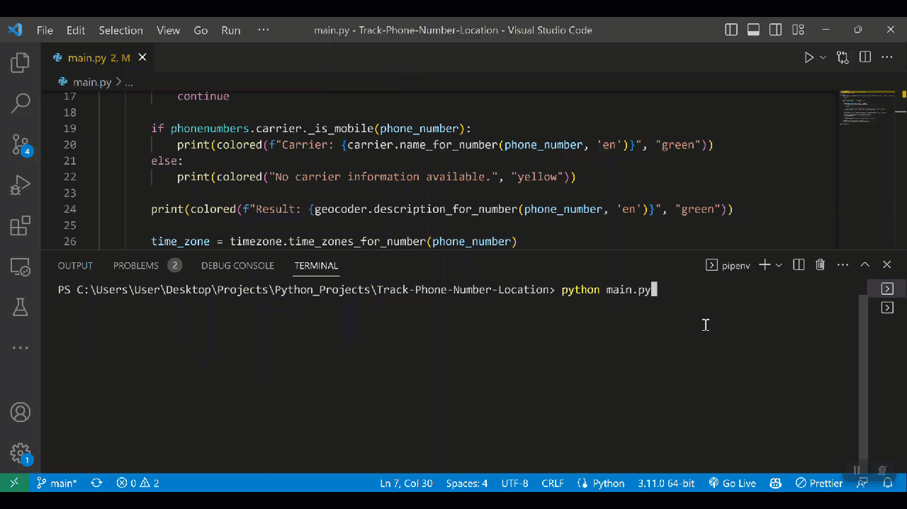

# International Phone Number Location Tracker

> The "Phone Number Geocoder" is a Python program that uses the phonenumbers library to geocode and display the country and region information for a given phone number, the timeZone, and if available the carrier information. The program can handle phone numbers from any country and removes non-numeric characters before parsing.




## Usage

#
1: Install the dependencies:

```bash
pipenv install -r requirements.txt 
```

#
2: Run server:

```bash
python main.py
```